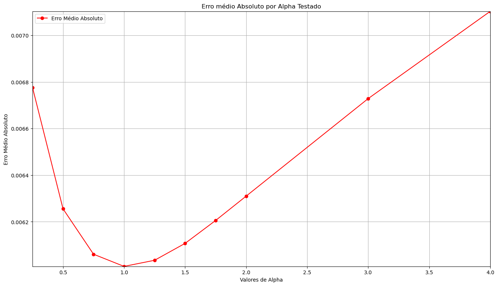
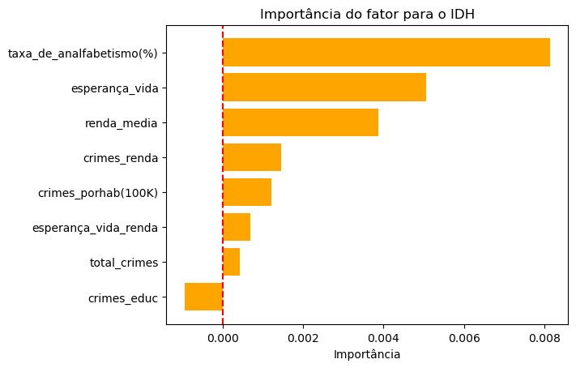

# Análise e Modelagem Preditiva de Impactos Socioeconômicos em Minas Gerais

## Contexto

A análise e a previsão de fatores socioeconômicos tornam-se especialmente relevantes no contexto brasileiro atual, marcado por desigualdades regionais persistentes e limitações na alocação eficiente de recursos públicos. A capacidade de antecipar como variáveis relacionadas à educação, saúde, renda e segurança impactam o desenvolvimento humano permite uma compreensão mais objetiva dos mecanismos que sustentam a vulnerabilidade social em diferentes regiões. Ao empregar modelos preditivos baseados em dados, é possível apoiar decisões estratégicas orientadas por evidências, identificar áreas prioritárias para intervenção e avaliar potenciais efeitos de políticas públicas antes de sua implementação. Dessa forma, a previsão desses fatores não apenas contribui para análises acadêmicas, mas também se configura como uma ferramenta relevante para o planejamento de ações que visem à redução das desigualdades e à promoção de um desenvolvimento socioeconômico mais equilibrado e sustentável no Brasil.

Este projeto tem como objetivo desenvolver um modelo de *Machine Learning* capaz de **avaliar, prever e visualizar os agentes e fenômenos que mais impactam o desenvolvimento socioeconômico**, utilizando como variável-alvo o **Índice de Desenvolvimento Humano (IDH)** das regiões do estado de Minas Gerais.

Todo o processo foi conduzido seguindo uma **metodologia estruturada**, desde a formulação do problema até a análise da importância das variáveis, garantindo coerência estatística, interpretabilidade e robustez dos resultados.

Foi adotado um método de 7 etapas para a construção do modelo:
- 1° Definição do objetivo
- 2° Coleta dos dados
- 3° Análise dos dados
- 4° Tratamento dos dados
- 5° Escolha do algoritmo
- 6° Treinamento e Teste
- 7° Ajuste de hiperparâmetros

## Definição do Objetivo

O desenvolvimento do modelo partiu da seguinte questão central:

> **Como poderíamos avaliar e prever/visualizar os agentes e fenômenos que mais causam impactos socioeconômicos no Brasil?**

Para tornar o problema tratável e mensurável, o estudo foi delimitado ao **estado de Minas Gerais**, utilizando dados agregados por Regiões Integradas de Segurança Pública (RISP).  
O **IDH** foi escolhido como variável-alvo por ser um **indicador consolidado**, amplamente utilizado para representar condições socioeconômicas, incorporando dimensões de **renda, educação e saúde**.

## Coleta dos Dados

Os dados utilizados neste projeto foram coletados a partir de fontes públicas e organizados em um dataset estruturado, contendo indicadores como:

- Renda média
- Taxas educacionais
- Indicadores criminais
- Expectativa de vida
- Variáveis demográficas e socioeconômicas

Todo o processo de coleta está documentado no repositório:

🔗 **https://github.com/jvrezendem/analise_socioeconomica_mg**

## Análise Exploratória dos Dados

A etapa de análise exploratória teve como objetivos principais:

- Compreender a distribuição das variáveis
- Identificar padrões e correlações
- Detectar possíveis inconsistências ou valores atípicos
- Avaliar relações iniciais entre os indicadores e o IDH

Essa análise permitiu observar que muitos fenômenos socioeconômicos apresentam **relações não triviais**, frequentemente mediadas por interações entre variáveis.

## Tratamento dos Dados e Engenharia de Atributos

### Limpeza e Preparação
Foram realizadas etapas de:
- Remoção de colunas não informativas ou identificadoras (ex: latitude, longitude, códigos administrativos)
- Padronização de nomes
- Garantia de consistência entre variáveis

### Engenharia de Atributos
Uma etapa fundamental do projeto foi a **engenharia de atributos**, que permitiu enriquecer o dataset original com novas variáveis derivadas, como:

- Relações entre criminalidade e renda
- Relações entre criminalidade e educação
- Interações entre expectativa de vida e renda
- Indicadores normalizados por população

Esses atributos derivados permitiram capturar **relações socioeconômicas mais profundas**, que não seriam observáveis apenas com variáveis brutas.

### Tabela 

| | Total de Crimes | Renda Média | IDH Médio | Taxa de Analfabetismo (%) | Esperança de Vida | Crimes por 100k hab | Crimes / Renda | Crimes / Educação | Esperança de Vida / Renda |
|------:|---------------:|-----------:|----------:|--------------------------:|------------------:|--------------------:|---------------:|------------------:|--------------------------:|
| 0  | 156   | 3341.20 | 0.810 | 2.220 | 76.370 | 6.74   | 0.0467 | 70.27  | 0.4896 |
| 1  | 2808  | 1305.20 | 0.695 | 3.881 | 75.297 | 147.37 | 2.1514 | 723.52 | 0.0268 |
| 2  | 2808  | 1495.46 | 0.715 | 3.599 | 75.464 | 284.18 | 1.8777 | 780.22 | 0.0269 |
| 3  | 13416 | 1150.62 | 0.673 | 4.880 | 74.831 | 852.24 | 11.6598 | 2749.18 | 0.0056 |
| 4  | 4680  | 1603.20 | 0.712 | 4.643 | 76.479 | 568.59 | 2.9192 | 1007.97 | 0.0163 |
| 5  | 6864  | 1268.97 | 0.695 | 5.377 | 75.285 | 779.62 | 5.4091 | 1276.55 | 0.0110 |
| 6  | 7800  | 1361.88 | 0.702 | 4.370 | 75.669 | 659.43 | 5.7274 | 1784.90 | 0.0097 |
| 7  | 9048  | 843.58  | 0.630 | 9.845 | 73.209 | 1315.27 | 10.7257 | 919.05 | 0.0081 |
| 8  | 2808  | 1500.40 | 0.714 | 3.975 | 75.982 | 255.15 | 1.8715 | 706.42 | 0.0271 |
| 9  | 3588  | 1487.99 | 0.707 | 5.203 | 75.607 | 671.27 | 2.4113 | 689.60 | 0.0211 |
| 10 | 12012 | 663.03  | 0.623 | 11.760 | 72.734 | 841.50 | 18.1168 | 1021.43 | 0.0061 |
| 11 | 15132 | 981.79  | 0.654 | 6.877 | 73.946 | 880.61 | 15.4127 | 2200.38 | 0.0049 |
| 12 | 9516  | 1031.53 | 0.671 | 5.157 | 74.462 | 1298.63 | 9.2251 | 1845.26 | 0.0078 |
| 13 | 8112  | 830.40  | 0.638 | 10.375 | 73.272 | 1203.60 | 9.7688 | 781.88 | 0.0090 |
| 14 | 9360  | 714.86  | 0.607 | 16.033 | 72.472 | 1133.64 | 13.0935 | 583.80 | 0.0077 |
| 15 | 2652  | 1026.21 | 0.675 | 7.021 | 74.161 | 702.37 | 2.5843 | 377.72 | 0.0280 |
| 16 | 11232 | 1238.88 | 0.691 | 5.181 | 75.330 | 1097.36 | 9.0663 | 2167.92 | 0.0067 |
| 17 | 8580  | 1420.19 | 0.707 | 5.057 | 75.911 | 776.25 | 6.0415 | 1696.66 | 0.0088 |
| 18 | 2496  | 1226.99 | 0.698 | 3.885 | 74.663 | 576.30 | 2.0342 | 642.47 | 0.0299 |

---

## Escolha do Algoritmo

### Modelos Avaliados
Foram testados **quatro algoritmos de regressão**, utilizando tanto **split fixo** quanto **validação cruzada**:

- Regressão Linear
- Regressor baseado em Árvore de Decisão
- Rede Neural (MLP)
- **Ridge Regressor**

### Algoritmo Escolhido — Ridge Regressor
O **Ridge Regressor** foi selecionado por apresentar:

- Melhor desempenho médio
- Maior estabilidade
- Menor sensibilidade à multicolinearidade
- Boa capacidade de generalização em **datasets pequenos**

O Ridge é uma regressão linear com **regularização L2**, que penaliza coeficientes excessivamente altos, reduzindo overfitting (quando o modelo "decora" os dados de treinamento) e tornando o modelo mais robusto.

### Validação Cruzada
Foi adotada a **validação cruzada K-Fold (K=5)** por:

- Reduzir dependência de um único split
- Permitir avaliação mais confiável do erro
- Ser especialmente adequada para bases de dados pequenas

A validação Cruzada (Cross Validation) realiza a divisão dos daddos de treino e test multiplas vezes, garantindo que todo o conjunto de dados seja usado para treinamento e teste em momentos diferentes.
O método K-Fold separa o conjunto de dados em *k* subconjuntos (os folds). Os dados são divididos em *k* partes iguais e o modelo é treinado *k* vezes.

---

## Treinamento e Teste do Modelo

### Variável-Alvo
- **IDH** foi escolhido como target por sintetizar múltiplas dimensões socioeconômicas e ser amplamente reconhecido.

### Variáveis Preditivas
Foram utilizadas todas as variáveis socioeconômicas relevantes, com exceção de:
- Colunas identificadoras
- Variáveis geográficas (latitude/longitude)
- Códigos administrativos

| Total de Crimes | Renda Média | Taxa de Analfabetismo (%) | Esperança de Vida | Crimes por 100k Hab | Crimes / Renda | Crimes / Educação | Esperança Vida / Renda |
|---------------:|------------:|---------------------------:|------------------:|--------------------:|---------------:|------------------:|-----------------------:|
| 156   | 3341.20 | 2.22  | 76.37 | 6.74   | 0.05  | 70.27  | 0.4896 |
| 2808  | 1305.20 | 3.88  | 75.30 | 147.37 | 2.15  | 723.52 | 0.0268 |
| 2808  | 1495.46 | 3.60  | 75.46 | 284.18 | 1.88  | 780.22 | 0.0269 |
| 13416 | 1150.62 | 4.88  | 74.83 | 852.24 | 11.66 | 2749.18| 0.0056 |
| 4680  | 1603.20 | 4.64  | 76.48 | 568.59 | 2.92  | 1007.97| 0.0163 |
| 6864  | 1268.97 | 5.38  | 75.29 | 779.62 | 5.41  | 1276.55| 0.0110 |
| 7800  | 1361.88 | 4.37  | 75.67 | 659.43 | 5.73  | 1784.90| 0.0097 |
| 9048  | 843.58  | 9.85  | 73.21 | 1315.27| 10.73 | 919.05 | 0.0081 |
| 2808  | 1500.40 | 3.98  | 75.98 | 255.15 | 1.87  | 706.42 | 0.0271 |
| 3588  | 1487.99 | 5.20  | 75.61 | 671.27 | 2.41  | 689.60 | 0.0211 |
| 12012 | 663.03  | 11.76 | 72.73 | 841.50 | 18.12 | 1021.43| 0.0061 |
| 15132 | 981.79  | 6.88  | 73.95 | 880.61 | 15.41 | 2200.38| 0.0049 |
| 9516  | 1031.53 | 5.16  | 74.46 | 1298.63| 9.23  | 1845.26| 0.0078 |
| 8112  | 830.40  | 10.38 | 73.27 | 1203.60| 9.77  | 781.88 | 0.0090 |
| 9360  | 714.86  | 16.03 | 72.47 | 1133.64| 13.09 | 583.80 | 0.0077 |
| 2652  | 1026.21 | 7.02  | 74.16 | 702.37 | 2.58  | 377.72 | 0.0280 |
| 11232 | 1238.88 | 5.18  | 75.33 | 1097.36| 9.07  | 2167.92| 0.0067 |
| 8580  | 1420.19 | 5.06  | 75.91 | 776.25 | 6.04  | 1696.66| 0.0088 |
| 2496  | 1226.99 | 3.89  | 74.66 | 576.30 | 2.03  | 642.47 | 0.0299 |

### Normalização

A normalização dos dados é realizada para garantir que todas as variáveis utilizadas no treinamento estejam na mesma escala, evitando que atributos com valores numéricos maiores exerçam influência desproporcional sobre o modelo. Esse processo melhora a estabilidade numérica, acelera a convergência dos algoritmos de otimização e contribui para um aprendizado mais equilibrado, resultando em modelos mais eficientes, confiáveis e interpretáveis.

Os dados foram padronizados utilizando **StandardScaler**, sempre ajustado **apenas no conjunto de treino**, evitando vazamento de informação.

### Processo de Treinamento
Em cada fold:
- O modelo foi treinado
- O erro foi avaliado
- As previsões foram armazenadas para análise comparativa

---

## Ajuste de Hiperparâmetros

Foi realizado um teste sistemático de diferentes valores do hiperparâmetro **α (alpha)** do Ridge Regressor.

O hiperparâmetro **α** controla o peso da regularização em relação ao erro. Ele muda o quanto o modelo é permitido a se adaptar aos dados.

A escolha do alpha foi baseada no **menor erro médio (MAE)** obtido via validação cruzada. Os valores de alpha testado foram [0.25, 0.5, 0.75, 1.0, 1.25, 1.5, 1.75, 2.0, 3.0, 4.0]

---

## Importância das Variáveis

Após a definição do modelo final, foram aplicados dois métodos complementares para avaliar a importância das variáveis na predição do IDH, para determinar assim qual fator mais influência na questão socioeconômica de Minas Gerais

### LOFO (Leave-One-Feature-Out)
O método Leave-One-Feature-Out (LOFO) é uma técnica de avaliação de importância de variáveis em que o modelo é treinado repetidamente, removendo uma feature por vez do conjunto de dados. A cada iteração, observa-se o impacto da ausência dessa variável no desempenho do modelo, medido por métricas como R² ou erro médio. Quanto maior a queda de desempenho ao retirar uma feature, maior é sua importância para o modelo, tornando o método especialmente útil para interpretar e entender quais variáveis mais contribuem para as previsões.

| Índice | Variável                     | Diferença de Erro |
|-------:|------------------------------|------------------:|
| 6 | crimes_educ                | -0.002297 |
| 7 | esperança_vida_renda       | -0.001209 |
| 1 | renda_media                |  0.000696 |
| 0 | total_crimes               |  0.000785 |
| 5 | crimes_renda               |  0.001353 |
| 4 | crimes_porhab(100K)        |  0.002331 |
| 3 | esperança_vida             |  0.004035 |
| 2 | taxa_de_analfabetismo(%)   |  0.011306 |

### Importância por Permutação
O método de importância por permutação avalia a relevância das variáveis ao medir o quanto o desempenho do modelo piora quando os valores de uma feature são embaralhados aleatoriamente. Ao permutar uma variável, sua relação com a variável alvo é quebrada, mantendo as demais intactas; se isso causar uma queda significativa na performance do modelo, entende-se que essa feature é importante. Esse método é amplamente utilizado por ser simples, intuitivo e aplicável a diferentes tipos de modelos, além de refletir diretamente o impacto de cada variável nas previsões.

| Índice | Variável                     | Diferença de MAE |
|-------:|------------------------------|-----------------:|
| 0 | total_crimes               | 0.000083 |
| 4 | crimes_porhab(100K)        | 0.000094 |
| 6 | crimes_educ                | 0.000415 |
| 5 | crimes_renda               | 0.001568 |
| 7 | esperança_vida_renda       | 0.002569 |
| 2 | taxa_de_analfabetismo(%)   | 0.004966 |
| 3 | esperança_vida             | 0.006077 |
| 1 | renda_media                | 0.007051 |

A combinação dos métodos Leave-One-Feature-Out e importância por permutação, por meio da média da diferença de erro observada em ambos, permite obter uma avaliação mais robusta e confiável da importância das variáveis, reduzindo vieses associados a um único critério de análise. Enquanto o LOFO mede o impacto estrutural da remoção completa de uma feature do modelo, a permutação avalia a sensibilidade do desempenho ao romper a relação estatística dessa variável com o alvo.

| Índice | Variável                   | ∆MAE (LOFO) | ∆MAE (Permutação) | Média ∆MAE (Importância) |
|------:|----------------------------|------------:|------------------:|------------------------:|
| 2 | taxa_de_analfabetismo(%) | 0.011306 | 0.004966 | 0.008136 |
| 3 | esperança_vida           | 0.004035 | 0.006077 | 0.005056 |
| 1 | renda_media              | 0.000696 | 0.007051 | 0.003873 |
| 5 | crimes_renda             | 0.001353 | 0.001568 | 0.001461 |
| 4 | crimes_porhab(100K)      | 0.002331 | 0.000094 | 0.001213 |
| 7 | esperança_vida_renda     | -0.001209 | 0.002569 | 0.000680 |
| 0 | total_crimes             | 0.000785 | 0.000083 | 0.000434 |
| 6 | crimes_educ              | -0.002297 | 0.000415 | -0.000941 |

---

## Conclusão

Entre os modelos avaliados neste estudo, o Ridge Regressor apresentou o melhor desempenho preditivo para o conjunto de dados analisado, tanto em termos de coeficiente de determinação (R² médio) quanto de erro médio absoluto (MAE).

A análise de importância das variáveis, conduzida por meio dos métodos Leave-One-Feature-Out (LOFO) e Importância por Permutação, revelou que **a educação (identificada pela variável taxa de analfabetismo) é o fator de maior relevância na determinação do Índice de Desenvolvimento Humano (IDH)** do estado de Minas Gerais. Esse resultado pode ser observado pelo aumento expressivo do erro de previsão quando a variável taxa de analfabetismo é removida ou permutada, indicando que a informação contida nessa variável é essencial para o desempenho do modelo.

Em seguida, os fatores relacionados **à saúde, representados pela esperança de vida**, e **à renda, expressa pela renda média da população**, também demonstraram elevada importância socioeconômica, uma vez que a degradação dessas variáveis resultou em perdas significativas na capacidade preditiva do modelo.

Esses achados sugerem que, no contexto analisado, **políticas públicas voltadas à educação possuem potencial impacto estrutural mais profundo sobre o desenvolvimento humano**, sendo complementadas de forma relevante por ações na área da saúde e da distribuição de renda. Ressalta-se, entretanto, que os resultados refletem associações estatísticas aprendidas pelo modelo, não implicando necessariamente relações de causalidade direta. 

Complementando essa conclusão, os resultados obtidos indicam que políticas públicas orientadas ao **fortalecimento da educação básica**, com foco na ampliação da qualidade do ensino e na redução das taxas de analfabetismo, tendem a produzir impactos estruturais significativos sobre o desenvolvimento humano. Adicionalmente, **o redirecionamento e a ampliação de investimentos no sistema público de saúde (SUS)** mostram-se fundamentais para garantir maior eficiência no atendimento à população, reduzindo a sobrecarga dos serviços e contribuindo para o aumento da expectativa de vida. Por fim, **reformas tributárias que ampliem o poder de compra da população**, especialmente das camadas de menor renda, podem atuar como mecanismo complementar de promoção do bem-estar social, ao estimular o consumo, reduzir desigualdades e fortalecer a capacidade econômica regional. Em conjunto, essas medidas evidenciam a necessidade de políticas públicas integradas, capazes de atuar simultaneamente sobre educação, saúde e renda, de modo a potencializar os efeitos positivos observados nos indicadores de desenvolvimento humano.

